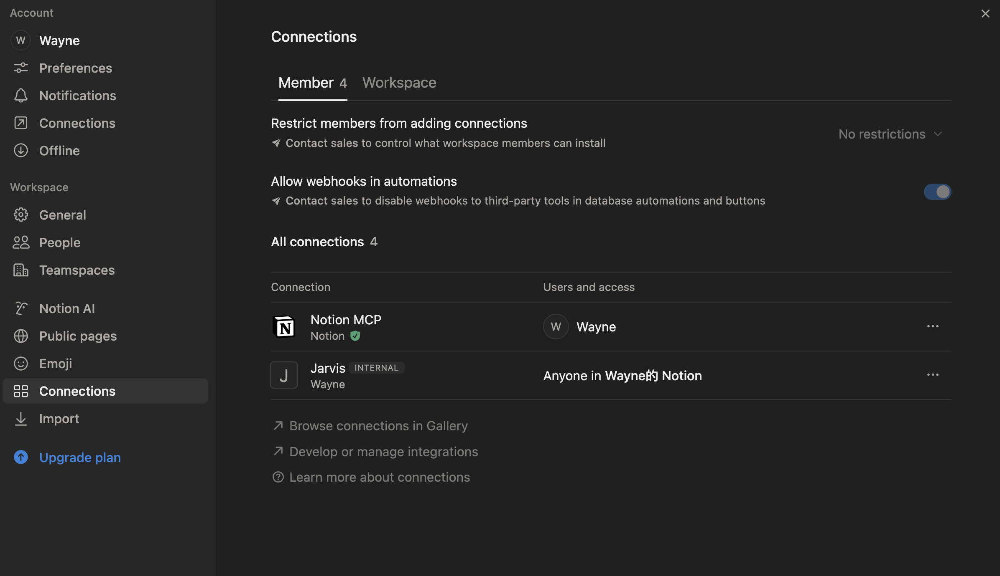
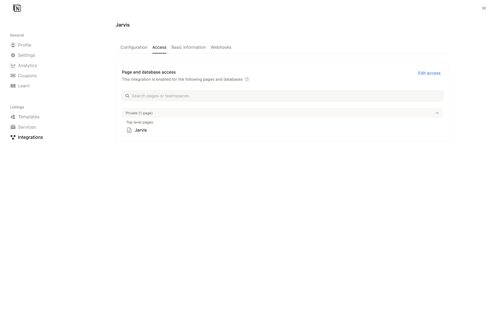
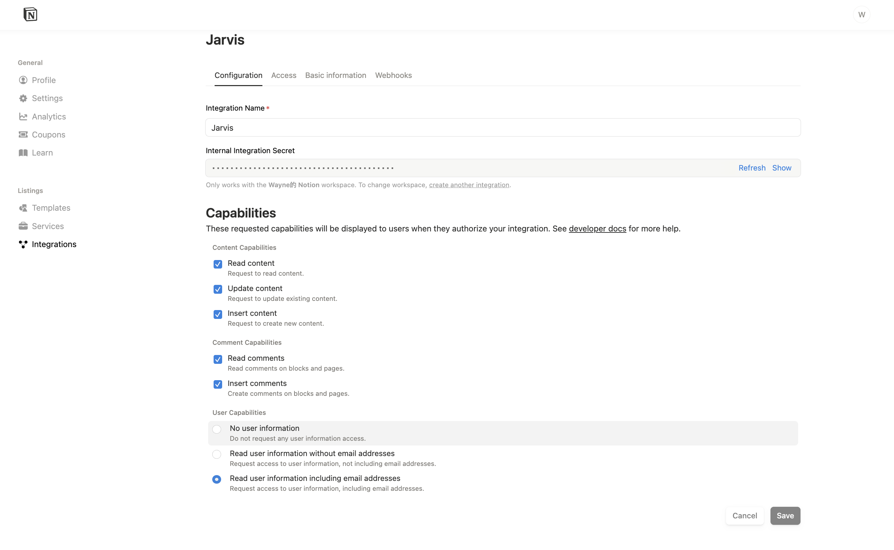

## Project Structure 

```text
.
├── agent/              # Core Agent Logic & LLM Client
│   └── router/         # Intent router (L1/L2 proposer + L3 reviewer)
├── config/             # user configs + mcp_servers registry
├── knowledge/          # Your documents (PDF, MD, CSV)
├── mcp_core/           # Native Model Context Protocol Client
├── output/             # Agent artifacts
├── papers/             # ArXiv下载的 PDF/MD（由 arxiv MCP 生成）
├── prompts/            # Centralized System Prompts
├── rag/                # RAG Pipeline
│   ├── chunk/          # Splitting strategies (Recursive, etc.)
│   ├── context.py      # Retrieval logic
│   ├── query_rewriter.py # LLM-based Query Decomposition
│   └── ...
├── utils/              # Shared utilities
└── main.py             # Entry point
```

## Quick Start

1) **Clone & Install**
```bash
git clone https://github.com/Jiawe1Zhang/Jarvis.git
pip install -r requirements.txt
```

2) **Configure Environment**
`.env` 中放模型/Notion Token 等：
```env
OPENAI_API_KEY=sk-...
OPENAI_BASE_URL=https://api.openai.com/v1
# OLLAMA_BASE_URL=http://localhost:11434/v1
NOTION_TOKEN=ntn_...
```

3) **配置**  
用户配置：`config/user_config.json`（或你的自定义文件）。  
MCP 注册表：`config/mcp_servers.json`（工具域/工具列表，用于路由筛选）。

核心开关示例：
```json
"knowledge": { "enabled": true },          // 是否允许用本地知识库（RAG）
"intent_router": { "enabled": true },      // 是否启用意图路由/工具筛选
"conversation_logging": {
  "enabled": true,
  "db_path": "data/sessions.db",
  "session_id": "your-session-id",
  "max_history": 5
}
```

4) **Run**
```bash
python main.py \
  --config config/user_config.json \
  --mcp-registry config/mcp_servers.json
```
运行后终端会提示输入 query；路由会决定是否检索本地知识、加载哪些 MCP 服务器（例如 arxiv、Notion、filesystem 等）。

## Evolution Roadmap (to be updated)

- **Agentic RAG Strategies**:
    - Recursive Character Text Splitting.
    - Query Rewriting (LLM-based).
    - Vector Database (Faiss in local).
    - [ ] **Reranking**: Cross-encoder based result re-ordering.
    - [ ] **More Advanced Chunking**: like Semantic and Agentic splitting strategies etc.
    - [ ] **Hybrid Search**: Vector + Keyword (BM25) retrieval.
    - [ ] **GraphRAG**

- [ ] **Agent Workflows Optimization**: Now just ReAct, I will update more workflows in the future.
    - [ ]: **Chat history**:  
        - ✅ **Short-term**: SQLite save and load
        - [ ] **Long-term Memory**: Memory Summarization
    - [ ]: **Multiple Agents** 
    - [ ]: ☹️**State Definition and State Graph (DAG)**: Plan, Execute, Reflect, Response & Plan n stpes -> execute ->execute -> response
- [ ] **Local Fine-tuning Pipeline (Model Ops)**:(Recently working on it)
    - [ ] **LLaMA-Factory Bridge**: Automated config generation to trigger LoRA/Full fine-tuning jobs using your RAG data.
- [ ] **Evaluation**🤔

## Agent Architecture Tricks in Recent Papers & Resources

- Agentic Plan Caching: Test-Time Memory for Fast and Cost-Efficient LLM Agents : https://openreview.net/forum?id=n4V3MSqK77

- https://www.youtube.com/watch?v=U2TP0pTsSlw
- https://www.youtube.com/watch?v=zYGDpG-pTho
- https://www.youtube.com/watch?v=gl1r1XV0SLw


## How to connect Notion 

Connect Jarvis to Notion via MCP without touching agent logic:

1) Create an integration  
   Go to Notion → Integrations → New integration in your workspace. Enable **Read content**, **Update content**, **Insert content**.  
     
   

2) Get the token  
   Copy the Internal Integration Token (`ntn_...`). Keep it in `.env`, not in code.

3) Choose pages/databases  
   Search the pages/databases you want the agent to connect. And give them Permissions.
   

4) Wire it into Jarvis  
   Add to `.env`:
   ```env
   NOTION_TOKEN=ntn_xxx
   ```  
   Add to `config/user_config.json` (`env` placeholders resolve from `.env` at runtime):
   ```json
   {
     "name": "notion",
     "command": "npx",
     "args": ["-y", "@modelcontextprotocol/server-notion"],
     "env": {
       "NOTION_TOKEN": "${NOTION_TOKEN}"
     }
   }
   ```

## License

MIT License
